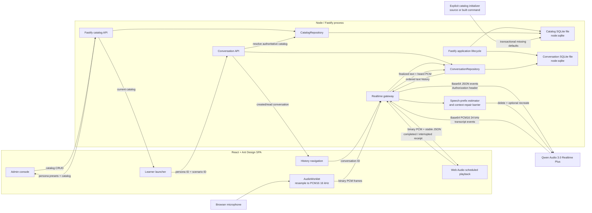

# Architecture

## Decision summary

The application is a single Node/TypeScript project containing a React SPA, a Fastify backend, shared protocol types, and two embedded SQLite databases. It uses one repository, one root package, and one toolchain.

The browser must not connect directly to Qwen Audio Realtime. Qwen requires an `Authorization` header during the WebSocket handshake, which browser WebSocket APIs cannot safely provide. More importantly, direct access would expose the permanent Model Studio API key.

SQLite is embedded in the Node process so the eventual deployment can remain one service and one container. Both database files should live on storage mounted into that container, not in a separately deployed database server or an ephemeral image layer. The catalog file persists editable configuration; the conversation file persists launch-time snapshots, pause/active-time state, plus authoritative text and PCM audio for finalized messages. Transient transcript drafts, unheard assistant suffixes, users, and evaluations are not persisted.

## Runtime topology



During development, Vite runs on port 5173 and proxies `/api` and `/ws` to Fastify on port 3001. This preserves a same-origin browser interface. Fastify opens both SQLite files during `onReady`, so a listening server has already created the database directory, applied both migration chains, and completed startup checks.

## Source boundaries

### `src/client`

- `routing/` owns the native History API route contract for `/`, `/admin`, `/chat/:conversationId`, and `/feedback/:conversationId`; `App.tsx` synchronizes those routes with safe realtime-session transitions.
- `App.tsx` owns session/UI state, catalog selection, the active-session configuration snapshot, and composition of learner, admin, and chat views.
- `learner/` owns the searchable scenario/persona selectors, compatibility-filtered launch summary, and per-launch difficulty selection.
- `admin/` owns searchable catalog lists, database-backed persona/scenario preset selection, locale-specific create/edit drawers, validation feedback, compatibility editing, deletion controls, and live Instructions preview.
- `catalog/` owns the JSON API client, catalog refresh lifecycle, pure bilingual display projection, and selection helpers. It contains no authored business catalog translations.
- `conversations/` owns history/feedback REST calls, list lifecycle, the shared desktop-rail/mobile-Drawer navigation, and the responsive ended-session coaching page.
- `i18n/` owns the English/Chinese preference, translation selection, Ant Design locale, document language, and `localStorage` persistence.
- `components/ConversationMessage.tsx` renders user/assistant chat rows.
- `components/VoiceWaveform.tsx` renders microphone-level recording feedback.
- `voice/press-to-talk-controller.ts` owns the asynchronous gesture state machine.
- `voice/use-press-to-talk.ts` maps pointer and keyboard events onto that state machine.
- `audio/` owns microphone permission, AudioContext lifecycle, capture, conversion, and response-aware playback.
- `realtime/` owns the browser side of the application WebSocket protocol.

React components do not know the upstream Qwen event schema. They use the stable application protocol in `src/shared`.

### `src/server`

- environment validation and health reporting;
- Fastify and browser WebSocket lifecycle;
- SQLite connection ownership and migrations;
- validated persona/scenario CRUD routes and the server-only `CatalogRepository`;
- validated conversation create/list/detail/pause/resume/restart/end/feedback/download routes plus server-only conversation and feedback repositories;
- asynchronous Qwen text-model feedback generation with structured JSON validation, transcript-reference validation, durable retry state, and optional server-calculated weighted scoring;
- input validation and audio frame limits;
- Qwen authentication and WebSocket lifecycle;
- translation between application messages and Qwen events;
- structural validation for every consumed Qwen event while ignoring unknown
  future event types;
- 30-second response-start and streaming-progress watchdogs plus one bounded,
  context-repaired retry for failed, empty, or malformed-audio responses;
- suppression of late audio after cancellation;
- completed-response speech-rate samples;
- interrupted assistant-item reconciliation;
- a delete/recreate barrier before the next inference.
- authoritative finalized-message persistence and bounded text-context rehydration before session readiness.
- request-time transcript rendering, mono timeline assembly, 16-to-24 kHz resampling, MP3 encoding, and ZIP packaging for downloads.

The permanent API key and database file paths exist only in this process.

### `src/shared`

- Zod schemas for browser control messages;
- Zod schemas for server events;
- Zod schemas and TypeScript types for bilingual persona/scenario presets, bilingual personas/scenarios, compatibility, voice behavior, difficulty, conversation summaries/details, and finalized messages;
- pure current-locale-with-fallback catalog projection helpers;
- the platform-neutral deterministic `compileRolePlayInstructions` template;
- shared TypeScript types;
- audio format constants.

Keep this directory platform-neutral. It must remain safe to bundle into the browser and must not import Node-only APIs, secrets, or SQLite code.

### `scripts`

- `initialize-catalog.ts` is the source entry point for `pnpm catalog:init` and is also bundled to `dist/server/initialize-catalog.js` for `pnpm catalog:init:prod`;
- `split-database.ts` is the guarded one-time migration from the historical combined file to the two current files;
- it reads only server/database configuration, opens `ApplicationDatabase`, applies pending migrations through normal database startup, invokes the transactional catalog initializer, reports inserted/skipped counts, and closes the connection;
- it does not start Fastify or read Qwen credentials.

## Responsive UI architecture

The learner launcher, admin console, and active session each have one component structure across viewport sizes. CSS changes layout and dimensions; React does not branch into separate mobile and desktop applications.

The learner launcher fetches `GET /api/catalog`, lets the learner search for a scenario, filters personas through the scenario's compatibility IDs, and offers easy/medium/hard difficulty. It summarizes goals, skill focus, role traits, behavior, and voice, then uses the shared deterministic compiler to preview the localized final Instructions and shared length budget before start. This browser result is presentation and early validation only; Node remains authoritative. The admin console uses the same catalog state for searchable persona/scenario tabs and responsive edit drawers. Persona and scenario editors keep preset IDs as form values while localizing only the option labels. A successful mutation applies its returned result locally and then reloads the complete catalog, so returning to the learner view shows saved changes immediately without rebuilding the SPA.

The learner workspace adds one responsive navigation region around the launcher or active session. At 1200 px and above, a 288 px history rail remains on the left. Below 1200 px, the rail is hidden and the same list content opens in an Ant Design Drawer from a header button. The Drawer/rail can select any persisted conversation or return to a new launch without creating a separate mobile page.

Top-level surfaces have stable browser URLs: `/` opens the learner launcher, `/admin` opens catalog administration, `/chat/:conversationId` restores an unended persisted conversation, and `/feedback/:conversationId` reviews an ended conversation. A paused chat route restores its immutable snapshots and finalized messages without opening the microphone or Qwen; the learner must choose **Continue session**. An unpaused route rebuilds the realtime connection. Selecting an ended item opens feedback and never creates a Qwen realtime connection. `useAppRoute` publishes every programmatic or popstate destination to a synchronous `routeRef` before scheduling React route state; the serialized session-transition coordinator must read that reference so a completion callback cannot act on the previous URL and clear freshly restored turns. Browser back/forward navigation uses the same settlement and teardown barriers as in-app navigation. Numeric IDs are valid URL path segments; do not introduce a second hash identifier without an authorization, public-enumeration, or external-sharing requirement.

The active session remains a four-row grid inside that workspace:

```text
chat header
snapshotted scenario goals
independently scrolling conversation
bottom voice composer
```

At widths above 767 px the chat is a centered, bounded shell. At 767 px and below it fills `100dvh`, removes the desktop border/radius/shadow, and applies safe-area padding to the header and composer. Message widths and control spacing tighten further on very narrow screens.

Ant Design supplies standard controls, feedback, icons, tokens, light/dark algorithms, and English/Chinese component locales. Project CSS supplies product-specific layout and chat visuals. The fixed global utility bar presents the product brand at left and global actions at right; the admin entry is textual and omitted only on `/admin`. The root `ConfigProvider`, `documentElement.dataset.theme`, CSS variables, and the browser `color-scheme` property change together. The theme preference is stored under `role-player:color-mode`; if no stored value exists, the OS preference is used. The language preference is stored under `role-player:locale`, defaults to English, and also controls `documentElement.lang`. Theme and locale changes update presentation only and do not recreate audio or realtime clients.

Conversation entries remain chronological and the flex list is bottom-aligned when short. New transcript data automatically scrolls to the end only while the reader is within 120 px of the bottom. Scrolling farther up disables auto-follow until the reader returns near the end.

See `docs/UI_INTERACTIONS.md` for the UI state and accessibility contract.

## Catalog and session-configuration flow

The current catalog database ends with strict, normalized catalog tables. Each of the five persona preset domains and four scenario preset domains has its own physical table and domain-named bilingual columns; API categories are derived rather than stored as discriminator columns. Persona/scenario records reference those rows by ID, with ordered relation tables for multi-select fields. A `NULL` success-criterion relation weight means the criterion is configured without a numerical rubric. `CatalogRepository` joins and maps them to a shared contract containing both stable IDs and resolved bilingual values. `GET /api/catalog` returns both preset collections alongside personas and scenarios. The separate conversation database starts with normalized immutable snapshot, message, audio, session-lifecycle, and feedback tables. Historical combined databases retain their append-only migrations 1–20 and are upgraded through migration 20 before the one-time splitter copies their two domains.

## Active-session lifecycle flow

The active-session header exposes pause, restart, and end. Each operation uses the same serialized settlement barrier: cancel uncertain input, wait for any committed learner transcript, reconcile heard assistant output, and only then change durable state. While an operation is running, voice input and competing session controls are disabled.

`POST /api/conversations/:id/pause` closes the current browser/Qwen transport after settlement, records `paused_at`, rolls the current active segment into `active_duration_ms`, and clears `active_started_at`. A paused chat remains visible with its transcript, but the push-to-talk and plus controls are replaced by one **Continue session** action. `POST /resume` clears `paused_at`, starts a new active segment, and then the normal fresh-Qwen history restoration runs. Closing the last browser realtime socket also idempotently pauses the durable session so disconnected time is never counted; configuring a replacement socket idempotently resumes it.

`POST /api/conversations/:id/restart` is intentionally an in-place reset rather than **Try again**. After confirmation, it transactionally deletes all owned messages (and cascading audio/feedback), resets active time, retains the same session ID and immutable persona/scenario/difficulty/Instructions/voice snapshot, and connects a clean Qwen session. Ended sessions reject pause, resume, and restart. Feedback duration comes from accumulated active segments, never wall-clock `ended_at - created_at`, so paused intervals are excluded.

## End-of-session feedback flow

The end button first uses the existing settlement barriers so only authoritative user text and heard assistant output are present. `POST /api/conversations/:id/end` then marks the session `ended`; ended sessions reject both new message writes and realtime restoration. A feedback report is created as `pending`, claimed as `processing`, and generated outside the SQLite transaction through DashScope's OpenAI-compatible chat-completions endpoint. `DASHSCOPE_FEEDBACK_MODEL` defaults to `qwen-plus` and reuses the server-only `DASHSCOPE_API_KEY`.

The text model receives both stored languages of immutable scenario metadata and configured scoring criteria, plus finalized transcript text as untrusted evidence. The prompt labels every stored `user` message as `learner_salesperson` and every stored `assistant` message as `ai_customer`: the real human learner is the sole evaluation/coaching subject, while the simulated customer is context evidence and must never receive criticism or improvement advice. Its JSON must attest `evaluationSubject: learner_salesperson` and contain exactly one score per stored criterion; an empty rubric therefore requires an empty score list while the textual assessment remains required. Human-readable fields must address the learner naturally and may not expose either internal label. It performs one evaluation and returns every human-readable value as an English field paired with a faithful `ZhCn` translation in the same object. Scores, positions, kinds, and transcript references exist only once, so language variants cannot diverge numerically or structurally. Both languages are persisted in normalized feedback tables, and the feedback page switches entirely from saved data without a model request. Conversation summaries/details likewise retain bilingual persona/scenario names so history, chat, and feedback metadata follow the current UI locale rather than the creation locale. Node gives the model the exact allowed learner-message IDs and dynamically caps highlights at the number of distinct finalized learner turns (up to six). Every candidate highlight returns a transient exact quote from its referenced learner message. When its assessment relies on customer context, it must also return an earlier AI-customer message ID and exact quote. Node verifies both normalized quotes, the speaker roles, and that the context precedes the learner turn. It additionally grounds every quoted assessment phrase in one of those verified excerpts and rejects visible `messageId N` / `第 N 条` references to later turns, then discards the grounding fields before persistence. When at least three distinct learner turns exist, at least three valid moments must survive this sanitization; an undersupplied response is retried up to three times with the exact validation reason. A one- or two-turn conversation is never forced to invent or duplicate highlights: its useful core report completes, and the browser derives a bilingual insufficient-evidence warning from the immutable transcript while retaining any valid cards. Invalid core structure, evaluation subject, internal-label leakage, criterion references, or required moment count are retried with correction. Failures persist stage-specific codes for conversation-data loading, missing configuration, timeout, unreachable provider, provider HTTP error, malformed provider envelope, invalid generated output, and SQLite persistence. Node calculates a weighted overall score only when the scenario snapshot contains a rubric; otherwise it persists `NULL`, and the feedback page omits both the score circle and breakdown while keeping assessment, tips, moments, and transcript. The current prompt version is `sales-coach-v5-minimum-three-moments`; opening a report from an older prompt lazily clears its obsolete children and queues regeneration, while process startup does not spend quota regenerating unopened history. A process restart resets abandoned `processing` rows to `pending` and resumes them. Missing feedback configuration never blocks application or realtime startup.

The feedback page can delete an ended conversation through `DELETE /api/conversations/:id`. Active rows are rejected. The route first aborts and awaits any in-process feedback job for that conversation, then deletes its `sessions` parent row; foreign-key cascades remove every immutable snapshot, finalized message/audio row, and feedback child. This ordering prevents a cancelled generator from recreating feedback after deletion. **Try again** is deliberately implemented through the normal `POST /api/conversations` path with the reviewed snapshot's source persona/scenario IDs and difficulty. It therefore creates a new immutable snapshot from the current catalog/current UI locale, receives a new ID, and does not mutate or clone transcript state from the ended record. Missing catalog entities or newly invalid compatibility fail normal creation validation.

## Conservative in-session success detection

After Qwen emits a complete assistant response and the associated learner transcript is authoritative, the realtime controller schedules a separate, asynchronous `qwen-plus` assessment. It does not wait for assistant audio playback, block recording, or alter Qwen Audio's conversation context. Evaluations are serialized per browser socket and use the immutable scenario success-criteria snapshot plus the finalized transcript and just-completed assistant text.

The text evaluator must return exactly one structured result per criterion, cite only transcript turn indexes, provide direct evidence, and assign at least `0.9` confidence. Node—not the model—requires every criterion to pass all of those checks before sending `scenario.success.detected` to the browser. Any uncertainty, partial progress, missing evidence, timeout, malformed response, or missing feedback-model configuration fails open: voice practice continues and no suggestion appears. The browser then offers an explicit choice to end and review or keep practicing; the server never ends the conversation automatically.

Schema evolution and business initialization are separate. All business defaults live in `src/server/catalog/initial-data/*.json`. `pnpm catalog:init` uses source TypeScript and `pnpm catalog:init:prod` uses the built initializer; both apply migrations and transactionally insert missing rows/links without overwriting existing rows. JSON seed keys provide idempotency, while SQLite assigns every public database ID. Neither command starts Fastify or needs Qwen credentials.

Localized entity fields use unsuffixed English names and explicit Simplified Chinese `ZhCn` names. Display/prompt code falls back only when preferred content is empty. Admin forms represent one locale at a time and never persist visible fallback text as a translation. Preset-backed form fields submit numeric IDs; the catalog API resolves their English/Chinese labels. There is one occupation preset reference and no separate identity concept.

Compatibility is a many-to-many relationship with an explicit position per scenario. Scenario writes validate that every referenced persona exists and replace compatibility rows transactionally. Persona deletion is rejected while any scenario references it; scenario deletion cascades its compatibility rows.

When the learner starts a session, `App.tsx` sends only `personaId`, `scenarioId`, the selected locale, and `Difficulty`. `POST /api/conversations` reloads both authoritative catalog records, validates compatibility, resolves every preset ID to bilingual text, stores that resolved snapshot, projects the selected locale on Node, and compiles Instructions with:

```ts
compileRolePlayInstructions({ persona, scenario, difficulty, locale })
```

The compiler is deterministic, not an additional LLM request. Its complete section labels and behavioral rules exist in English and Chinese; the current UI locale selects both the template and localized catalog projection. Persona and scenario drawers preview their own independent sections without length counters. All three preview surfaces use the same always-expanded card treatment and expose copy immediately after the title. The learner launcher calls the same compiler for an early, inspectable full preview and disables start if it exceeds the limit; `ConversationRepository` still reloads authoritative records, combines the sections in the submitted locale, and performs the final validation at conversation creation. The stored Instructions—not a browser-supplied string—are sent unchanged to Qwen. Empty optional scenario lists omit their complete prompt sections. Persona owns reusable character attributes and the Qwen voice; scenario owns context, optional hidden success/scoring criteria, and optional tone/pace/interjection behavior.

The application protocol caps Instructions at 12,000 characters. `CatalogRepository` checks compatible combinations and conversation creation performs the authoritative final check. A pre-ready realtime error rejects connection immediately instead of waiting for the startup timeout.

Realtime error UX is phase-aware. A conversation that has never been ready tears
down failed initialization and surfaces the error on the launcher. After its
first readiness, recoverable errors stay on the current socket and appear in an
Ant Design message at the top for five seconds. Fatal runtime errors preserve
the chat surface but discard the uncertain audio/Qwen runtime, then perform one
serialized same-conversation rebuild from finalized SQLite text. Runtime epochs make the old socket's delayed
callbacks harmless. A failed rebuild leaves the durable chat surface open with
the composer changed to a manual reconnect action; only a connection that has
never been ready returns to the launcher.

Response failures have a narrower first line of recovery than socket failures.
When Qwen returns `failed`, a completed response lacks either transcript or
audio, PCM is malformed, or streaming makes no progress for 30 seconds, Node
suppresses the failed output, deletes its assistant item through the normal
context-repair acknowledgement barrier, and issues one more `response.create`
for the same already-committed user item. It never recommits microphone audio.
A second failed/empty attempt is cleaned up and reported as recoverable so the
learner can speak again. Waiting for the initial `response.created` also has a
30-second deadline; because a missing acknowledgement leaves upstream state
uncertain, that path uses the fresh-session recovery instead of sending a
possibly duplicate request on the old socket.

When a fatal service/socket failure occurs after the learner turn is already
durable, the replacement session restores SQLite text first. The browser then
sends `response.retry`; the gateway accepts it only if the latest persisted
message is still an unanswered user turn. This makes the visible retry useful
without causing ordinary history navigation to generate new speech. A response
retry failure does not recursively reconnect forever: the current fault chain
remains consumed until an assistant response is persisted, and a second fatal
failure exposes the existing manual reconnect action.

The conversation repository stores the exact snapshot in normalized snapshot tables together with compiled text and selected voice. Browser `session.configure` sends only the durable conversation ID and a bounded history-turn limit. Node selects that recent user-turn window in SQLite, reloads the stored Instructions/voice, opens a new Qwen WebSocket, and injects the finalized user/assistant text with `conversation.item.create`. It emits `session.ready` only after Qwen acknowledges every injected item. This is semantic text-context restoration, not revival of an expired Qwen session; original audio tone/emotion is not restored. The active snapshot also supplies the persona name shown in chat, and later catalog edits affect only new conversations.

Scenario `voiceBehavior.interruptFrequency` is prompt-level conversational behavior. With manual push-to-talk it cannot make Qwen seize the microphone while the learner is still speaking. Learner barge-in is the separate playback interruption/reconciliation mechanism.

See `docs/CATALOG_AND_PROMPTS.md` for the field, API, and compiler contracts.

## Press-to-talk architecture

The gesture controller is intentionally separate from React so synchronous pointer events and asynchronous microphone setup have one testable lifecycle:

```text
idle → starting → recording → finishing → idle
          │            │
          └─ release ──┘  finish immediately after startup resolves
```

`activePress` records whether the user is still holding while `start()` awaits microphone setup. Releasing during `starting` is therefore not lost. A normal release submits once; crossing the 72 px upward threshold marks the release for cancellation. Forced cancellation is used when pointer capture is lost unexpectedly, the pointer is cancelled, the window loses focus, the document becomes hidden, input becomes disabled, or the component/session is torn down.

When the AI is speaking, the same control remains available for barge-in. `beginRecording` first stops scheduled playback and sends the conservative `playback.interrupted` receipt for the active response, then sends `input.start` and begins microphone capture. This lets the user speak while Node performs the assistant-context repair barrier. Normal release later flushes capture and commits the turn. Cancelled input removes its browser draft immediately, waits for Qwen's clear acknowledgement, and is never committed. Final user transcription is persisted only when its `item_id` matches the acknowledgement for the pending audio commit, so late events from a cancelled turn cannot leak into history or a later recording.

## Alternate voice-input modes

The plus control beside push-to-talk exposes two modes without changing the
application wire protocol:

- **Long recording** calls the same `input.start` and capture startup as a
  normal hold, but keeps capture open until the learner clicks **End speaking**.
  Worklet flush, `input.commit`, transcription, persistence, and response
  handling remain identical to push-to-talk.
- **Free conversation** keeps browser capture open and uses
  `FreeConversationController` to convert RMS levels into turns. It confirms
  speech for 120 ms, retains five 100 ms PCM chunks as pre-roll, opens
  `input.start` before flushing that pre-roll, and commits after 900 ms of
  silence. A modestly higher speech threshold while AI playback is active
  reduces echo false positives without excluding a quiet learner; confirmed
  learner speech still runs the normal conservative playback-interruption flow.
  Re-entry explicitly clears the push-to-talk block before capture restarts so
  an immediate first word is not lost. One turn is capped at two minutes.

Free conversation intentionally keeps Qwen at `turn_detection: null`. This
preserves the existing item-ID persistence barrier, exact per-turn PCM capture,
cancel/recovery semantics, and best-effort heard-prefix reconciliation. It is
hands-free and supports learner barge-in, but the model cannot autonomously
start talking over an input turn before browser silence commits it. True Qwen
`smart_turn` duplex would require a new session configuration plus server-side
VAD audio segmentation/persistence and is not silently approximated here.

## Audio pipeline

### Input

1. A user gesture creates and resumes one `AudioContext`.
2. `getUserMedia` requests mono input with echo cancellation and noise suppression, but requests automatic gain control off because browser/device AGC can introduce inconsistent startup gain.
3. The effective, privacy-safe track settings (sample rate, channel count, and processing flags only) are logged once for diagnostics; browser constraints are best effort.
4. The live track gets a 350 ms session-level settling window and an 80 Hz high-pass filter before capture, reducing initialization transients and low-frequency rumble without delaying ordinary holds after session setup.
5. The browser can still choose 44.1 or 48 kHz, so the AudioWorklet reads its actual global sample rate.
6. Channels are averaged to mono.
7. A streaming area downsampler converts audio to 16 kHz.
8. Samples are clamped and encoded as little-endian PCM16.
9. Normal chunks contain 1,600 samples: 100 ms / 3,200 bytes.
10. Browser-to-Node frames are binary; Node performs the Base64 conversion required by Qwen.

When capture stops, the Worklet first emits its final partial chunk and then emits a `stopped` acknowledgement. The browser sends `input.commit` only after that acknowledgement. This ordering is an invariant.

The capture engine also reports a normalized RMS input level. `VoiceWaveform` applies a square-root perceptual curve to that value so quiet speech remains visible; the waveform is feedback only and does not affect encoded audio. The playback path owns an `AnalyserNode` and reports output RMS while scheduled sources are audible; free-conversation mode uses the input/output levels only to animate its orb.

### Output

1. Qwen emits Base64 PCM16 24 kHz deltas.
2. Node decodes them and sends binary WebSocket frames to the browser.
3. `response.started` establishes the response ID that owns subsequent binary frames. The MVP permits one concurrent assistant response; binary frames do not contain their own header.
4. The browser converts PCM16 to Float32 `AudioBuffer` instances at 24 kHz.
5. Buffers are scheduled on a shared `AudioContext` with a small initial lead time, while their response ID, start time, and end time are retained.
6. Qwen `response.done` marks generation terminal but does not mark playback complete. The browser reports `playback.completed` only after all sources end naturally.

Persisted PCM remains the original submitted/heard conversation evidence. MP3 export performs non-destructive request-time mastering on a copy: each finalized turn measures only 20 ms frames above -45 dBFS, targets -20 dBFS active-speech RMS, limits gain/attenuation to 12 dB, and caps peaks at -1 dBFS. A single turn-wide gain avoids pumping the noise floor between words. SQLite PCM and Qwen input are never rewritten by export mastering.
7. On interruption, the browser snapshots rendered duration before stopping sources, removes output latency and a 300 ms safety allowance, clears the queue immediately, and sends `playback.interrupted` with `safePlayedMs`.

## Best-effort interruption reconciliation

Generation and playback are separate timelines. Qwen can finish generating an assistant message while several seconds of its PCM remain queued in Web Audio. Its conversation item therefore cannot be treated as heard merely because `response.done` arrived.

The browser calculates a conservative playback receipt from scheduled source intervals. Already ended sources count in full, a currently playing source only counts up to `AudioContext.currentTime`, and future/prebuffered sources do not count. Output latency and a fixed 300 ms margin are subtracted. Muting at any point makes the response's audibility uncertain and forces a zero-duration receipt. This remains best effort because the browser cannot observe operating-system volume, Bluetooth buffering, or the user's physical output device.

Node records transcript and PCM duration per `responseId`. Naturally completed responses of at least one second feed a bounded, per-language speech-rate history. When playback is interrupted, Node combines the safe duration, current response rate, and stable history to estimate a word/Han-character prefix. The estimate is conservative and prefers completed sentence boundaries.

Qwen has no in-place truncate operation for this item type, so repair is an ordered transaction:

```text
cancel generation if necessary
  → wait for terminal response
  → delete original assistant item
  → optionally recreate conservative assistant-text prefix
  → emit response.reconciled
  → release pending response.create
```

High- or medium-confidence estimates retain the conservative prefix. A low-confidence estimate rolls back the entire assistant item. Node does not start the next model inference until Qwen acknowledges the delete and optional replacement creation. Repair timeout or uncertain context closes the session instead of allowing an unheard full response to remain in model history.

## Session model

The MVP uses manual turn detection (`turn_detection: null`):

```text
connecting → ready → listening → processing → speaking → ready
                    ↘ cancel ────────────────────────────↗
```

Manual mode directly supports recording cancellation and deterministic push-to-talk UI states.

An assistant response has two coordinated state machines:

```text
generation: creating → generating → completed/cancelled/failed
playback:   pending  → completed
                    ↘ interrupted → reconciled
```

`response.done` advances only the generation state. A naturally drained browser queue advances playback through `playback.completed`, then remains pending until the matching `response.persisted`; user barge-in or Stop AI uses `playback.interrupted` and waits for `response.reconciled`. Switching conversations, starting a new role-play, pausing, restarting, and ending the session share one serialized settlement barrier: active playback is reconciled, an already-committed user transcript is acknowledged after persistence, and any response created during that wait is checked again before teardown. Timeout, close, or receipt-send failure is a failed barrier rather than a synthetic success.

## SQLite architecture

`ApplicationDatabase` wraps one synchronous `node:sqlite` `DatabaseSync` connection. `registerDatabases` decorates Fastify with independent `catalogDatabase` and `conversationDatabase` owners and connects both to the `onReady`/`onClose` lifecycle. Relative `CATALOG_DATABASE_PATH` and `CONVERSATION_DATABASE_PATH` values resolve from `process.cwd()`, and their parent directories are created automatically.

Startup enables SQLite `DELETE` journal mode, foreign-key enforcement, and a 5-second busy timeout before running migrations. The single-process/one-connection-per-file design does not need WAL's persistent `-wal`/`-shm` sidecars. Rollback journaling remains crash-safe; a transient `-journal` may exist during a write. Migration definitions are ordered, immutable entries; the runner applies each pending migration in its own immediate transaction and rejects incompatible on-disk history.

Each fresh file has its own migration table and domain schema migration. Schema migrations do not own current business defaults. Catalog records use `CatalogRepository`; conversation records use `ConversationRepository`, and its snapshots intentionally have no foreign keys to the catalog file. This separation means catalog backup/reset/initialization and conversation retention can evolve independently.

The current ownership contract is a private single-user deployment with one global history. Text and audio share the owning finalized message and are retained with the SQLite file. The user may permanently delete ended conversations, but there is no automatic retention job; active conversations cannot be deleted. The service must not be publicly or multi-tenant exposed until authentication, authorization, owner filtering, and a retention policy are added. MP3/ZIP artifacts are generated per request and are not retained. Users and evaluations remain intentionally absent. Because `DatabaseSync` is synchronous, long queries must not run on the Node event loop without redesign; request-time MP3 encoding is currently bounded to 64 MiB of source PCM and processes one message segment at a time.

See `docs/DATABASE.md` for operational and migration details.

## Development and production build shape

Both parts live in one package but have separate build outputs:

```text
Vite                          → dist/client
tsup server + initializer     → dist/server
```

The Node build keeps `removeNodeProtocol: false` and externalizes `node:sqlite`. Removing that setting can rewrite the valid built-in specifier to a nonexistent bare `sqlite` module and break both the server and production initializer.

The next deployment milestone should add static file serving to Fastify:

1. register `@fastify/static` with `dist/client`;
2. return `index.html` for SPA routes that are not `/api` or `/ws`;
3. build both outputs in one Docker build stage;
4. run only `dist/server/index.js` in the final image;
5. mount the directory containing both configured database paths as a persistent volume;
6. run `pnpm catalog:init:prod` against that volume before starting the Node service.

No client/server repository split and no separately deployed database service are planned.

## Growth path

Recommended additions, in order:

1. validate real Qwen history-injection behavior and latency with longer test conversations;
2. add application authentication, admin authorization, per-owner history filtering, and WebSocket authorization;
3. define automatic retention rules and ownership-aware deletion for a future authenticated deployment;
4. add structured post-session evaluation with a text model;
5. add catalog audit/version history and tenant ownership when product requirements require them;
6. add network-aware exponential backoff and an explicit offline state on top
   of the current bounded response retry and one-shot same-conversation runtime
   recovery;
7. add metrics, rate limiting, quotas, and cost controls;
8. add production static serving and a single Docker image with persistent SQLite storage.
