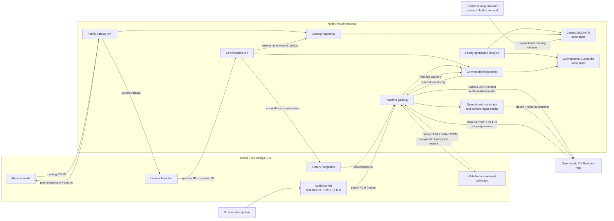

# Architecture

## Decision summary

The application is a single Node/TypeScript project containing a React SPA, a Fastify backend, shared protocol types, and two embedded SQLite databases. It uses one repository, one root package, and one toolchain.

The browser must not connect directly to Qwen Audio Realtime. Qwen requires an `Authorization` header during the WebSocket handshake, which browser WebSocket APIs cannot safely provide. More importantly, direct access would expose the permanent Model Studio API key.

SQLite is embedded in the Node process so the eventual deployment can remain one service and one container. Both database files should live on storage mounted into that container, not in a separately deployed database server or an ephemeral image layer. The catalog file persists editable configuration; the conversation file persists text history and launch-time persona/scenario/difficulty snapshots. Audio, transient transcript drafts, users, and evaluations are not persisted.

## Runtime topology



During development, Vite runs on port 5173 and proxies `/api` and `/ws` to Fastify on port 3001. This preserves a same-origin browser interface. Fastify opens both SQLite files during `onReady`, so a listening server has already created the database directory, applied both migration chains, and completed startup checks.

## Source boundaries

### `src/client`

- `App.tsx` owns session/UI state, catalog selection, the active-session configuration snapshot, and composition of learner, admin, and chat views.
- `learner/` owns the searchable scenario/persona selectors, compatibility-filtered launch summary, and per-launch difficulty selection.
- `admin/` owns searchable catalog lists, database-backed persona/scenario preset selection, locale-specific create/edit drawers, validation feedback, compatibility editing, deletion controls, and live Instructions preview.
- `catalog/` owns the JSON API client, catalog refresh lifecycle, pure bilingual display projection, and selection helpers. It contains no authored business catalog translations.
- `conversations/` owns history REST calls, list lifecycle, and the shared desktop-rail/mobile-Drawer navigation.
- `i18n/` owns the English/Chinese preference, translation selection, Ant Design locale, document language, and `localStorage` persistence.
- `components/ConversationMessage.tsx` renders user/assistant chat rows.
- `components/VoiceWaveform.tsx` renders microphone-level recording feedback.
- `voice/press-to-talk-controller.ts` owns the asynchronous gesture state machine.
- `voice/use-press-to-talk.ts` maps pointer and keyboard events onto that state machine.
- `audio/` owns microphone permission, AudioContext lifecycle, capture, conversion, and response-aware playback.
- `realtime/` owns the browser side of the application WebSocket protocol.

React components do not know the upstream Qwen event schema. They use the stable application protocol in `src/shared`.

### `src/server`

- environment validation and health reporting;
- Fastify and browser WebSocket lifecycle;
- SQLite connection ownership and migrations;
- validated persona/scenario CRUD routes and the server-only `CatalogRepository`;
- validated conversation create/list/detail routes and the server-only `ConversationRepository`;
- input validation and audio frame limits;
- Qwen authentication and WebSocket lifecycle;
- translation between application messages and Qwen events;
- suppression of late audio after cancellation;
- completed-response speech-rate samples;
- interrupted assistant-item reconciliation;
- a delete/recreate barrier before the next inference.
- authoritative finalized-message persistence and bounded text-context rehydration before session readiness.

The permanent API key and database file paths exist only in this process.

### `src/shared`

- Zod schemas for browser control messages;
- Zod schemas for server events;
- Zod schemas and TypeScript types for bilingual persona/scenario presets, bilingual personas/scenarios, compatibility, voice behavior, difficulty, conversation summaries/details, and finalized messages;
- pure current-locale-with-fallback catalog projection helpers;
- the platform-neutral deterministic `compileRolePlayInstructions` template;
- shared TypeScript types;
- audio format constants.

Keep this directory platform-neutral. It must remain safe to bundle into the browser and must not import Node-only APIs, secrets, or SQLite code.

### `scripts`

- `initialize-catalog.ts` is the source entry point for `pnpm catalog:init` and is also bundled to `dist/server/initialize-catalog.js` for `pnpm catalog:init:prod`;
- `split-database.ts` is the guarded one-time migration from the historical combined file to the two current files;
- it reads only server/database configuration, opens `ApplicationDatabase`, applies pending migrations through normal database startup, invokes the transactional catalog initializer, reports inserted/skipped counts, and closes the connection;
- it does not start Fastify or read Qwen credentials.

## Responsive UI architecture

The learner launcher, admin console, and active session each have one component structure across viewport sizes. CSS changes layout and dimensions; React does not branch into separate mobile and desktop applications.

The learner launcher fetches `GET /api/catalog`, lets the learner search for a scenario, filters personas through the scenario's compatibility IDs, and offers easy/medium/hard difficulty. It summarizes goals, skill focus, role traits, behavior, and voice before start. The admin console uses the same catalog state for searchable persona/scenario tabs and responsive edit drawers. Persona and scenario editors keep preset IDs as form values while localizing only the option labels. A successful mutation applies its returned result locally and then reloads the complete catalog, so returning to the learner view shows saved changes immediately without rebuilding the SPA.

The learner workspace adds one responsive navigation region around the launcher or active session. At 1200 px and above, a 288 px history rail remains on the left. Below 1200 px, the rail is hidden and the same list content opens in an Ant Design Drawer from a header button. The Drawer/rail can select any persisted conversation or return to a new launch without creating a separate mobile page.

The active session remains a three-row grid inside that workspace:

```text
chat header
independently scrolling conversation
bottom voice composer
```

At widths above 767 px the chat is a centered, bounded shell. At 767 px and below it fills `100dvh`, removes the desktop border/radius/shadow, and applies safe-area padding to the header and composer. Message widths and control spacing tighten further on very narrow screens.

Ant Design supplies standard controls, feedback, icons, tokens, light/dark algorithms, and English/Chinese component locales. Project CSS supplies product-specific layout and chat visuals. The root `ConfigProvider`, `documentElement.dataset.theme`, CSS variables, and the browser `color-scheme` property change together. The theme preference is stored under `role-player:color-mode`; if no stored value exists, the OS preference is used. The language preference is stored under `role-player:locale`, defaults to English, and also controls `documentElement.lang`. Theme and locale changes update presentation only and do not recreate audio or realtime clients.

Conversation entries remain chronological and the flex list is bottom-aligned when short. New transcript data automatically scrolls to the end only while the reader is within 120 px of the bottom. Scrolling farther up disables auto-follow until the reader returns near the end.

See `docs/UI_INTERACTIONS.md` for the UI state and accessibility contract.

## Catalog and session-configuration flow

The current catalog database ends with strict, normalized catalog tables. Each of the six persona preset domains and three scenario preset domains has its own physical table and domain-named bilingual columns; API categories are derived rather than stored as discriminator columns. Persona/scenario records reference those rows by ID, with ordered relation tables for multi-select fields. `CatalogRepository` joins and maps them to a shared contract containing both stable IDs and resolved bilingual values. `GET /api/catalog` returns both preset collections alongside personas and scenarios. The separate conversation database starts with normalized immutable snapshot and message tables. Historical combined databases retain their append-only migrations 1–15 and are upgraded through migration 15 before the one-time splitter copies their two domains.

Schema evolution and business initialization are separate. All business defaults live in `src/server/catalog/initial-data/*.json`. `pnpm catalog:init` uses source TypeScript and `pnpm catalog:init:prod` uses the built initializer; both apply migrations and transactionally insert missing rows/links without overwriting existing rows. JSON seed keys provide idempotency, while SQLite assigns every public database ID. Neither command starts Fastify or needs Qwen credentials.

Localized entity fields use unsuffixed English names and explicit Simplified Chinese `ZhCn` names. Display/prompt code falls back only when preferred content is empty. Admin forms represent one locale at a time and never persist visible fallback text as a translation. Preset-backed form fields submit numeric IDs; the catalog API resolves their English/Chinese labels. There is one occupation preset reference and no separate identity concept.

Compatibility is a many-to-many relationship with an explicit position per scenario. Scenario writes validate that every referenced persona exists and replace compatibility rows transactionally. Persona deletion is rejected while any scenario references it; scenario deletion cascades its compatibility rows.

When the learner starts a session, `App.tsx` sends only `personaId`, `scenarioId`, the selected locale, and `Difficulty`. `POST /api/conversations` reloads both authoritative catalog records, validates compatibility, resolves every preset ID to bilingual text, stores that resolved snapshot, projects the selected locale on Node, and compiles Instructions with:

```ts
compileRolePlayInstructions({ persona, scenario, difficulty })
```

The compiler is deterministic, not an additional LLM request. Persona and scenario drawers preview their own independent sections; `ConversationRepository` alone combines both sections with difficulty at conversation creation. Persona owns occupation, voice, pace, and interjection behavior; scenario owns context and hidden success/scoring criteria.

The application protocol caps Instructions at 12,000 characters. `CatalogRepository` checks compatible combinations and conversation creation performs the authoritative final check. A pre-ready realtime error rejects connection immediately instead of waiting for the startup timeout.

Realtime error UX is phase-aware. A conversation that has never been ready tears
down failed initialization and surfaces the error on the launcher. After its
first readiness, recoverable errors stay on the current socket and appear in an
Ant Design message at the top for five seconds. Fatal runtime errors preserve
the chat surface but discard the uncertain audio/Qwen runtime, then perform one
serialized same-conversation rebuild from finalized SQLite text. Runtime epochs make the old socket's delayed
callbacks harmless. A failed rebuild leaves the durable chat surface open with
the composer changed to a manual reconnect action; only a connection that has
never been ready returns to the launcher.

The conversation repository stores the exact snapshot in normalized snapshot tables together with compiled text and selected voice. Browser `session.configure` sends only the durable conversation ID and a bounded history-turn limit. Node selects that recent user-turn window in SQLite, reloads the stored Instructions/voice, opens a new Qwen WebSocket, and injects the finalized user/assistant text with `conversation.item.create`. It emits `session.ready` only after Qwen acknowledges every injected item. This is semantic text-context restoration, not revival of an expired Qwen session; original audio tone/emotion is not restored. The active snapshot also supplies the persona name shown in chat, and later catalog edits affect only new conversations.

Persona `voiceBehavior.interruptFrequency` is prompt-level conversational behavior. With manual push-to-talk it cannot make Qwen seize the microphone while the learner is still speaking. Learner barge-in is the separate playback interruption/reconciliation mechanism.

See `docs/CATALOG_AND_PROMPTS.md` for the field, API, and compiler contracts.

## Press-to-talk architecture

The gesture controller is intentionally separate from React so synchronous pointer events and asynchronous microphone setup have one testable lifecycle:

```text
idle → starting → recording → finishing → idle
          │            │
          └─ release ──┘  finish immediately after startup resolves
```

`activePress` records whether the user is still holding while `start()` awaits microphone setup. Releasing during `starting` is therefore not lost. A normal release submits once; crossing the 72 px upward threshold marks the release for cancellation. Forced cancellation is used when pointer capture is lost unexpectedly, the pointer is cancelled, the window loses focus, the document becomes hidden, input becomes disabled, or the component/session is torn down.

When the AI is speaking, the same control remains available for barge-in. `beginRecording` first stops scheduled playback and sends the conservative `playback.interrupted` receipt for the active response, then sends `input.start` and begins microphone capture. This lets the user speak while Node performs the assistant-context repair barrier. Normal release later flushes capture and commits the turn; cancelled input is cleared and never committed.

## Audio pipeline

### Input

1. A user gesture creates and resumes one `AudioContext`.
2. `getUserMedia` requests mono input, echo cancellation, noise suppression, and automatic gain control.
3. The browser can still choose 44.1 or 48 kHz, so the AudioWorklet reads its actual global sample rate.
4. Channels are averaged to mono.
5. A streaming area downsampler converts audio to 16 kHz.
6. Samples are clamped and encoded as little-endian PCM16.
7. Normal chunks contain 1,600 samples: 100 ms / 3,200 bytes.
8. Browser-to-Node frames are binary; Node performs the Base64 conversion required by Qwen.

When capture stops, the Worklet first emits its final partial chunk and then emits a `stopped` acknowledgement. The browser sends `input.commit` only after that acknowledgement. This ordering is an invariant.

The capture engine also reports a normalized RMS input level. `VoiceWaveform` applies a square-root perceptual curve to that value so quiet speech remains visible; the waveform is feedback only and does not affect encoded audio.

### Output

1. Qwen emits Base64 PCM16 24 kHz deltas.
2. Node decodes them and sends binary WebSocket frames to the browser.
3. `response.started` establishes the response ID that owns subsequent binary frames. The MVP permits one concurrent assistant response; binary frames do not contain their own header.
4. The browser converts PCM16 to Float32 `AudioBuffer` instances at 24 kHz.
5. Buffers are scheduled on a shared `AudioContext` with a small initial lead time, while their response ID, start time, and end time are retained.
6. Qwen `response.done` marks generation terminal but does not mark playback complete. The browser reports `playback.completed` only after all sources end naturally.
7. On interruption, the browser snapshots rendered duration before stopping sources, removes output latency and a 300 ms safety allowance, clears the queue immediately, and sends `playback.interrupted` with `safePlayedMs`.

## Best-effort interruption reconciliation

Generation and playback are separate timelines. Qwen can finish generating an assistant message while several seconds of its PCM remain queued in Web Audio. Its conversation item therefore cannot be treated as heard merely because `response.done` arrived.

The browser calculates a conservative playback receipt from scheduled source intervals. Already ended sources count in full, a currently playing source only counts up to `AudioContext.currentTime`, and future/prebuffered sources do not count. Output latency and a fixed 300 ms margin are subtracted. Muting at any point makes the response's audibility uncertain and forces a zero-duration receipt. This remains best effort because the browser cannot observe operating-system volume, Bluetooth buffering, or the user's physical output device.

Node records transcript and PCM duration per `responseId`. Naturally completed responses of at least one second feed a bounded, per-language speech-rate history. When playback is interrupted, Node combines the safe duration, current response rate, and stable history to estimate a word/Han-character prefix. The estimate is conservative and prefers completed sentence boundaries.

Qwen has no in-place truncate operation for this item type, so repair is an ordered transaction:

```text
cancel generation if necessary
  → wait for terminal response
  → delete original assistant item
  → optionally recreate conservative assistant-text prefix
  → emit response.reconciled
  → release pending response.create
```

High- or medium-confidence estimates retain the conservative prefix. A low-confidence estimate rolls back the entire assistant item. Node does not start the next model inference until Qwen acknowledges the delete and optional replacement creation. Repair timeout or uncertain context closes the session instead of allowing an unheard full response to remain in model history.

## Session model

The MVP uses manual turn detection (`turn_detection: null`):

```text
connecting → ready → listening → processing → speaking → ready
                    ↘ cancel ────────────────────────────↗
```

Manual mode directly supports recording cancellation and deterministic push-to-talk UI states.

An assistant response has two coordinated state machines:

```text
generation: creating → generating → completed/cancelled/failed
playback:   pending  → completed
                    ↘ interrupted → reconciled
```

`response.done` advances only the generation state. A naturally drained browser queue advances playback through `playback.completed`, then remains pending until the matching `response.persisted`; user barge-in or Stop AI uses `playback.interrupted` and waits for `response.reconciled`. Switching conversations, starting a new role-play, and ending the session share one serialized settlement barrier: active playback is reconciled, an already-committed user transcript is acknowledged after persistence, and any response created during that wait is checked again before teardown. Timeout, close, or receipt-send failure is a failed barrier rather than a synthetic success.

## SQLite architecture

`ApplicationDatabase` wraps one synchronous `node:sqlite` `DatabaseSync` connection. `registerDatabases` decorates Fastify with independent `catalogDatabase` and `conversationDatabase` owners and connects both to the `onReady`/`onClose` lifecycle. Relative `CATALOG_DATABASE_PATH` and `CONVERSATION_DATABASE_PATH` values resolve from `process.cwd()`, and their parent directories are created automatically.

Startup enables SQLite `DELETE` journal mode, foreign-key enforcement, and a 5-second busy timeout before running migrations. The single-process/one-connection-per-file design does not need WAL's persistent `-wal`/`-shm` sidecars. Rollback journaling remains crash-safe; a transient `-journal` may exist during a write. Migration definitions are ordered, immutable entries; the runner applies each pending migration in its own immediate transaction and rejects incompatible on-disk history.

Each fresh file has its own migration table and domain schema migration. Schema migrations do not own current business defaults. Catalog records use `CatalogRepository`; conversation records use `ConversationRepository`, and its snapshots intentionally have no foreign keys to the catalog file. This separation means catalog backup/reset/initialization and conversation retention can evolve independently.

The current ownership contract is a private single-user deployment with one global history. Conversation data is retained with the SQLite file, has no deletion API yet, and must not be publicly or multi-tenant exposed until authentication, authorization, owner filtering, and a deletion policy are added. Audio, users, and evaluations remain intentionally absent. Because `DatabaseSync` is synchronous, long queries must not run on the Node event loop without redesign.

See `docs/DATABASE.md` for operational and migration details.

## Development and production build shape

Both parts live in one package but have separate build outputs:

```text
Vite                          → dist/client
tsup server + initializer     → dist/server
```

The Node build keeps `removeNodeProtocol: false` and externalizes `node:sqlite`. Removing that setting can rewrite the valid built-in specifier to a nonexistent bare `sqlite` module and break both the server and production initializer.

The next deployment milestone should add static file serving to Fastify:

1. register `@fastify/static` with `dist/client`;
2. return `index.html` for SPA routes that are not `/api` or `/ws`;
3. build both outputs in one Docker build stage;
4. run only `dist/server/index.js` in the final image;
5. mount the directory containing both configured database paths as a persistent volume;
6. run `pnpm catalog:init:prod` against that volume before starting the Node service.

No client/server repository split and no separately deployed database service are planned.

## Growth path

Recommended additions, in order:

1. validate real Qwen history-injection behavior and latency with longer test conversations;
2. add application authentication, admin authorization, per-owner history filtering, and WebSocket authorization;
3. define user-facing retention/deletion controls and add them to the existing conversation domain;
4. add structured post-session evaluation with a text model;
5. add catalog audit/version history and tenant ownership when product requirements require them;
6. add bounded retry/backoff and offline-state controls on top of the current one-shot same-conversation runtime recovery;
7. add metrics, rate limiting, quotas, and cost controls;
8. add production static serving and a single Docker image with persistent SQLite storage.
