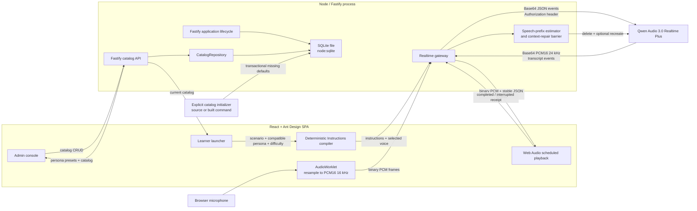

# Architecture

## Decision summary

The application is a single Node/TypeScript project containing a React SPA, a Fastify backend, shared protocol types, and an embedded SQLite database. It uses one repository, one root package, and one toolchain.

The browser must not connect directly to Qwen Audio Realtime. Qwen requires an `Authorization` header during the WebSocket handshake, which browser WebSocket APIs cannot safely provide. More importantly, direct access would expose the permanent Model Studio API key.

SQLite is embedded in the Node process so the eventual deployment can remain one service and one container. Its database file should live on storage mounted into that container, not in a separately deployed database server or an ephemeral image layer. It persists the editable persona/scenario catalog, compatibility links, and persona-editor presets. Realtime conversations, learner difficulty choices, transcripts, and evaluations are still held in memory.

## Runtime topology



During development, Vite runs on port 5173 and proxies `/api` and `/ws` to Fastify on port 3001. This preserves a same-origin browser interface. Fastify opens SQLite during `onReady`, so a listening server has already created the database directory, applied migrations, and completed startup checks.

## Source boundaries

### `src/client`

- `App.tsx` owns session/UI state, catalog selection, the active-session configuration snapshot, and composition of learner, admin, and chat views.
- `learner/` owns the searchable scenario/persona selectors, compatibility-filtered launch summary, and per-launch difficulty selection.
- `admin/` owns searchable catalog lists, database-backed persona preset selection, create/edit drawers, validation feedback, compatibility editing, deletion controls, and live Instructions preview.
- `catalog/` owns the JSON API client, catalog refresh lifecycle, and selection helpers.
- `components/ConversationMessage.tsx` renders user/assistant chat rows.
- `components/VoiceWaveform.tsx` renders microphone-level recording feedback.
- `voice/press-to-talk-controller.ts` owns the asynchronous gesture state machine.
- `voice/use-press-to-talk.ts` maps pointer and keyboard events onto that state machine.
- `audio/` owns microphone permission, AudioContext lifecycle, capture, conversion, and response-aware playback.
- `realtime/` owns the browser side of the application WebSocket protocol.

React components do not know the upstream Qwen event schema. They use the stable application protocol in `src/shared`.

### `src/server`

- environment validation and health reporting;
- Fastify and browser WebSocket lifecycle;
- SQLite connection ownership and migrations;
- validated persona/scenario CRUD routes and the server-only `CatalogRepository`;
- input validation and audio frame limits;
- Qwen authentication and WebSocket lifecycle;
- translation between application messages and Qwen events;
- suppression of late audio after cancellation;
- completed-response speech-rate samples;
- interrupted assistant-item reconciliation;
- a delete/recreate barrier before the next inference.

The permanent API key and database file path exist only in this process.

### `src/shared`

- Zod schemas for browser control messages;
- Zod schemas for server events;
- Zod schemas and TypeScript types for persona presets, personas, scenarios, compatibility, voice behavior, and difficulty;
- the platform-neutral deterministic `compileRolePlayInstructions` template;
- shared TypeScript types;
- audio format constants.

Keep this directory platform-neutral. It must remain safe to bundle into the browser and must not import Node-only APIs, secrets, or SQLite code.

### `scripts`

- `initialize-catalog.ts` is the source entry point for `pnpm catalog:init` and is also bundled to `dist/server/initialize-catalog.js` for `pnpm catalog:init:prod`;
- it reads only server/database configuration, opens `ApplicationDatabase`, applies pending migrations through normal database startup, invokes the transactional catalog initializer, reports inserted/skipped counts, and closes the connection;
- it does not start Fastify or read Qwen credentials.

## Responsive UI architecture

The learner launcher, admin console, and active session each have one component structure across viewport sizes. CSS changes layout and dimensions; React does not branch into separate mobile and desktop applications.

The learner launcher fetches `GET /api/catalog`, lets the learner search for a scenario, filters personas through the scenario's compatibility IDs, and offers easy/medium/hard difficulty. It summarizes goals, skill focus, role traits, behavior, and voice before start. The admin console uses the same catalog state for searchable persona/scenario tabs and responsive edit drawers. Its persona editor filters `personaPresets` by category and stores selected text in the persona payload; presets are never live references. A successful mutation applies its returned result locally and then reloads the complete catalog, so returning to the learner view shows saved changes immediately without rebuilding the SPA.

The active session is a three-row grid:

```text
chat header
independently scrolling conversation
bottom voice composer
```

At widths above 767 px the chat is a centered, bounded shell. At 767 px and below it fills `100dvh`, removes the desktop border/radius/shadow, and applies safe-area padding to the header and composer. Message widths and control spacing tighten further on very narrow screens.

Ant Design supplies standard controls, feedback, icons, tokens, and light/dark algorithms. Project CSS supplies product-specific layout and chat visuals. The root `ConfigProvider`, `documentElement.dataset.theme`, CSS variables, and the browser `color-scheme` property change together. The preference is stored under `role-player:color-mode`; if no stored value exists, the OS preference is used. Theme changes update presentation only and do not recreate audio or realtime clients.

Conversation entries remain chronological and the flex list is bottom-aligned when short. New transcript data automatically scrolls to the end only while the reader is within 120 px of the bottom. Scrolling farther up disables auto-follow until the reader returns near the end.

See `docs/UI_INTERACTIONS.md` for the UI state and accessibility contract.

## Catalog and session-configuration flow

Migration 2 creates strict `personas`, `scenarios`, and `scenario_personas` tables and contains the immutable legacy Alex/sales-discovery seed. Migration 3 adds deterministic compatibility ordering for both new and already-created catalog files. Migration 4 creates strict `persona_presets` schema with the six supported categories, but no business rows. `CatalogRepository` maps catalog/preset rows to the shared Zod contract and keeps short synchronous reads/writes behind one server boundary. `GET /api/catalog` returns presets with personas and scenarios; the existing mutation routes remain persona/scenario CRUD boundaries.

Schema evolution and business initialization are separate. `pnpm catalog:init` uses source TypeScript during development; `pnpm catalog:init:prod` uses the built initializer during deployment. Each opens the configured database, applies pending migrations, then transactionally inserts 70 missing Chinese presets, 林悦/王强/陈晨 personas, and—when `scenario_sales_discovery` exists—missing compatibility links appended after the existing positions. Every missing link first passes the shared easy/medium/hard 12,000-character Instructions check; a failure identifies the pair and rolls back the initializer transaction. Stable IDs/category-values make repeated execution safe and preserve administrator-edited rows. Occupied preset positions are handled by appending within the category rather than moving current data. Neither command starts Fastify, needs Qwen credentials, nor recreates an absent default scenario.

Persona presets are intentionally denormalized at selection time. Identity, occupation, traits, communication style, motivations, and concerns are copied as text into a persona. There is no preset foreign key, so editing preset reference data cannot silently change an active or saved role. The editor also carries forward existing non-preset text as a selectable legacy value.

Compatibility is a many-to-many relationship with an explicit position per scenario. Scenario writes validate that every referenced persona exists and replace compatibility rows transactionally. Persona deletion is rejected while any scenario references it; scenario deletion cascades its compatibility rows.

When the learner starts a session, `App.tsx` snapshots the chosen `Persona`, `Scenario`, and `Difficulty`. It calls:

```ts
compileRolePlayInstructions({ persona, scenario, difficulty })
```

The compiler is a deterministic shared template, not an additional LLM request. It translates structured configuration into stable sections for persona identity, scenario context, hidden success/scoring criteria, difficulty, tone, pace, interjection behavior, and non-negotiable role-play rules. This makes output previewable, testable, repeatable, and free of a second model's latency/cost/failure mode.

The application protocol caps Instructions at 12,000 characters. Admin forms and `CatalogRepository` check every compatible persona/scenario combination across all three difficulties; the REST API returns `400 instructions_too_long` rather than persisting a combination that cannot start. `App.tsx` checks again before microphone setup, and a pre-ready realtime error rejects connection immediately instead of waiting for the startup timeout.

The realtime connect call sends the compiled text as `session.configure.instructions` and `persona.voice` as the separate Qwen `voice` parameter. The active snapshot also supplies the persona name shown in chat. A later catalog refresh can update the next launch but cannot change a conversation already in progress.

`voiceBehavior.interruptFrequency` is prompt-level conversational behavior. Because the session uses manual push-to-talk and `turn_detection: null`, it can make a customer more patient or more likely to use brief interjections/challenges within its response, but it cannot make Qwen seize the microphone while the learner is still speaking. Learner barge-in is the separate playback interruption/reconciliation mechanism.

See `docs/CATALOG_AND_PROMPTS.md` for the field, API, and compiler contracts.

## Press-to-talk architecture

The gesture controller is intentionally separate from React so synchronous pointer events and asynchronous microphone setup have one testable lifecycle:

```text
idle → starting → recording → finishing → idle
          │            │
          └─ release ──┘  finish immediately after startup resolves
```

`activePress` records whether the user is still holding while `start()` awaits microphone setup. Releasing during `starting` is therefore not lost. A normal release submits once; crossing the 72 px upward threshold marks the release for cancellation. Forced cancellation is used when pointer capture is lost unexpectedly, the pointer is cancelled, the window loses focus, the document becomes hidden, input becomes disabled, or the component/session is torn down.

When the AI is speaking, the same control remains available for barge-in. `beginRecording` first stops scheduled playback and sends the conservative `playback.interrupted` receipt for the active response, then sends `input.start` and begins microphone capture. This lets the user speak while Node performs the assistant-context repair barrier. Normal release later flushes capture and commits the turn; cancelled input is cleared and never committed.

## Audio pipeline

### Input

1. A user gesture creates and resumes one `AudioContext`.
2. `getUserMedia` requests mono input, echo cancellation, noise suppression, and automatic gain control.
3. The browser can still choose 44.1 or 48 kHz, so the AudioWorklet reads its actual global sample rate.
4. Channels are averaged to mono.
5. A streaming area downsampler converts audio to 16 kHz.
6. Samples are clamped and encoded as little-endian PCM16.
7. Normal chunks contain 1,600 samples: 100 ms / 3,200 bytes.
8. Browser-to-Node frames are binary; Node performs the Base64 conversion required by Qwen.

When capture stops, the Worklet first emits its final partial chunk and then emits a `stopped` acknowledgement. The browser sends `input.commit` only after that acknowledgement. This ordering is an invariant.

The capture engine also reports a normalized RMS input level. `VoiceWaveform` applies a square-root perceptual curve to that value so quiet speech remains visible; the waveform is feedback only and does not affect encoded audio.

### Output

1. Qwen emits Base64 PCM16 24 kHz deltas.
2. Node decodes them and sends binary WebSocket frames to the browser.
3. `response.started` establishes the response ID that owns subsequent binary frames. The MVP permits one concurrent assistant response; binary frames do not contain their own header.
4. The browser converts PCM16 to Float32 `AudioBuffer` instances at 24 kHz.
5. Buffers are scheduled on a shared `AudioContext` with a small initial lead time, while their response ID, start time, and end time are retained.
6. Qwen `response.done` marks generation terminal but does not mark playback complete. The browser reports `playback.completed` only after all sources end naturally.
7. On interruption, the browser snapshots rendered duration before stopping sources, removes output latency and a 300 ms safety allowance, clears the queue immediately, and sends `playback.interrupted` with `safePlayedMs`.

## Best-effort interruption reconciliation

Generation and playback are separate timelines. Qwen can finish generating an assistant message while several seconds of its PCM remain queued in Web Audio. Its conversation item therefore cannot be treated as heard merely because `response.done` arrived.

The browser calculates a conservative playback receipt from scheduled source intervals. Already ended sources count in full, a currently playing source only counts up to `AudioContext.currentTime`, and future/prebuffered sources do not count. Output latency and a fixed 300 ms margin are subtracted. Muting at any point makes the response's audibility uncertain and forces a zero-duration receipt. This remains best effort because the browser cannot observe operating-system volume, Bluetooth buffering, or the user's physical output device.

Node records transcript and PCM duration per `responseId`. Naturally completed responses of at least one second feed a bounded, per-language speech-rate history. When playback is interrupted, Node combines the safe duration, current response rate, and stable history to estimate a word/Han-character prefix. The estimate is conservative and prefers completed sentence boundaries.

Qwen has no in-place truncate operation for this item type, so repair is an ordered transaction:

```text
cancel generation if necessary
  → wait for terminal response
  → delete original assistant item
  → optionally recreate conservative assistant-text prefix
  → emit response.reconciled
  → release pending response.create
```

High- or medium-confidence estimates retain the conservative prefix. A low-confidence estimate rolls back the entire assistant item. Node does not start the next model inference until Qwen acknowledges the delete and optional replacement creation. Repair timeout or uncertain context closes the session instead of allowing an unheard full response to remain in model history.

## Session model

The MVP uses manual turn detection (`turn_detection: null`):

```text
connecting → ready → listening → processing → speaking → ready
                    ↘ cancel ────────────────────────────↗
```

Manual mode directly supports recording cancellation and deterministic push-to-talk UI states.

An assistant response has two coordinated state machines:

```text
generation: creating → generating → completed/cancelled/failed
playback:   pending  → completed
                    ↘ interrupted → reconciled
```

`response.done` advances only the generation state. A naturally drained browser queue advances playback through `playback.completed`; user barge-in or Stop AI uses `playback.interrupted` and waits for `response.reconciled`.

## SQLite architecture

`ApplicationDatabase` wraps one synchronous `node:sqlite` `DatabaseSync` connection. `registerDatabase` decorates Fastify with that owner and connects it to the `onReady`/`onClose` lifecycle. A relative `DATABASE_PATH` is resolved from `process.cwd()` and its parent directory is created automatically.

Startup enables WAL journal mode, foreign-key enforcement, and a 5-second busy timeout before running migrations. Migration definitions are ordered, immutable entries; the runner applies each pending migration in its own immediate transaction and rejects incompatible on-disk history.

Migration 1 creates strict `schema_migrations`. Migration 2 creates strict `personas`, `scenarios`, and `scenario_personas`, the reverse persona index, and its legacy default catalog. Migration 3 adds `scenario_personas.position` plus its per-scenario unique index as a forward-compatible upgrade. Migration 4 creates strict `persona_presets`; editable preset/persona defaults are supplied only by the explicit initializer. Catalog records survive restart and are accessed through `CatalogRepository`; no session, transcript, audio, user, learner selection, or evaluation data is persisted. Future domain tables should be introduced through new migrations plus small server-side repositories after ownership, authorization, retention, deletion, and recovery requirements are established. Because the current API is synchronous, long queries must not run on the Node event loop without redesign.

See `docs/DATABASE.md` for operational and migration details.

## Development and production build shape

Both parts live in one package but have separate build outputs:

```text
Vite                          → dist/client
tsup server + initializer     → dist/server
```

The Node build keeps `removeNodeProtocol: false` and externalizes `node:sqlite`. Removing that setting can rewrite the valid built-in specifier to a nonexistent bare `sqlite` module and break both the server and production initializer.

The next deployment milestone should add static file serving to Fastify:

1. register `@fastify/static` with `dist/client`;
2. return `index.html` for SPA routes that are not `/api` or `/ws`;
3. build both outputs in one Docker build stage;
4. run only `dist/server/index.js` in the final image;
5. mount the directory containing `DATABASE_PATH` as a persistent volume;
6. run `pnpm catalog:init:prod` against that volume before starting the Node service.

No client/server repository split and no separately deployed database service are planned.

## Growth path

Recommended additions, in order:

1. validate real Qwen behavior and latency with fixed catalog configurations and test conversations;
2. add application authentication, admin authorization, and WebSocket authorization;
3. define retention/recovery requirements, then persist sessions, transcripts, and learner/evaluation records;
4. add structured post-session evaluation with a text model;
5. add catalog audit/version history and tenant ownership when product requirements require them;
6. add reconnect and text-context rehydration;
7. add metrics, rate limiting, quotas, and cost controls;
8. add production static serving and a single Docker image with persistent SQLite storage.
